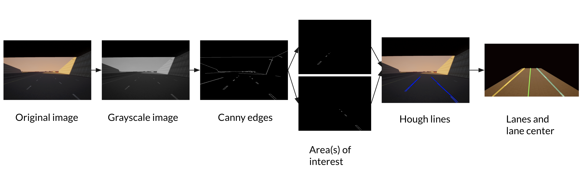

## Welcome to GitHub Pages

You can use the [editor on GitHub](https://github.com/asdegoyeneche/ROAR/edit/gh-pages/index.md) to maintain and preview the content for your website in Markdown files.

Whenever you commit to this repository, GitHub Pages will run [Jekyll](https://jekyllrb.com/) to rebuild the pages in your site, from the content in your Markdown files.

### Markdown

Markdown is a lightweight and easy-to-use syntax for styling your writing. It includes conventions for

```markdown
Syntax highlighted code block

# Header 1
## Header 2
### Header 3

- Bulleted
- List

1. Numbered
2. List

**Bold** and _Italic_ and `Code` text

[Link](url) and 
```

For more details see [GitHub Flavored Markdown](https://guides.github.com/features/mastering-markdown/).

### Jekyll Themes

Your Pages site will use the layout and styles from the Jekyll theme you have selected in your [repository settings](https://github.com/asdegoyeneche/ROAR/settings). The name of this theme is saved in the Jekyll `_config.yml` configuration file.

### Support or Contact

Having trouble with Pages? Check out our [documentation](https://docs.github.com/categories/github-pages-basics/) or [contact support](https://github.com/contact) and we’ll help you sort it out.

## Sensing

### Lane Detection



The lane detector takes the images captured by the front RGB and depth camera as input and calculates the 3-D world coornidates of the left lane, right lane, and lane center in sight. At each time step, the procedure of lane detection algorithm is as follows:

- Converts the original RGB image to a grayscale image.
- Calculates the canny edges of the image.
- Cuts out two triangle-shaped areas of interests, one on the left bottom part of the image, another on the right bottom part.
- Calculates hough lines from each image and take their average to form two straight lines as our detected lanes.
- Calculates world coordinates of lanes using depth camera image.
- Use the average of world coordinates of left and right lanes as the lane center.

## Planning

`lane_following_local_planner.py` contains the main logic of our lane following planner. We define a variable, confidence, which is a scalar between 0 and 1. It decays exponentially when a lane is not detected, and is reset to 1 when both are detected.  We calculate the target location based on a weighted sum of the mid point of lane center and the next waypoint. We also limit the target speed by confidence. The location of the next waypoint and target speed are then fed into our controller. The pseudocode of the lane following algorithm is as follows:

```python3
def follow_lane(waypoints, α: confidence decay rate 0~1, β: speed limit factor >0):
    confidence = 1
    for each step:
        left_lane, right_lane, lane_center = detect_lanes_from_camera_input()
        if left_lane or right_lane not detected:
            confidence = confidence * α
        else:
            confidence = 1
        target_location = mid_point(lane_center) * confidence + 
                              get_next_waypoint(waypoints) * (1 - confidence)
        target_speed = maximum_speed * exp((1 - confidence) * -β)
        controller.run(target_location, target_speed)
```
